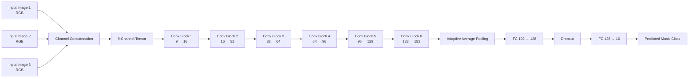

# Deep Learning Music Classification Using CNN

A 16-class music classification system built with a custom convolutional neural network (CNN) and a multi-input image representation. The project combines three RGB image inputs into a 9-channel tensor and trains a CNN implemented largely from scratch.

## Overview

Music classification can be formulated as a multi-class visual learning problem when music-related representations are provided as images. This project investigates a custom CNN for classifying samples into 16 music categories.

The model receives three RGB image inputs for each sample. Each image is transformed consistently and the three 3-channel images are concatenated to form a 9-channel input tensor. A six-block CNN then extracts hierarchical features and predicts one of the 16 target classes.

The project focuses on understanding CNN components and their implementation rather than relying entirely on a pre-built CNN architecture.

## Problem Statement

The objective is to classify music samples into 16 categories from a set of image-based inputs while maintaining balanced performance across classes.

The main challenges addressed are:

- Combining multiple image inputs into a single model input.
- Learning discriminative visual features for 16 music categories.
- Implementing core CNN operations without relying entirely on pre-built convolutional layers.
- Monitoring class-balanced performance using Macro F1-score.
- Evaluating the trained model using accuracy, precision, recall, F1-score, and a confusion matrix.

## Objectives

- Build a multi-input dataset pipeline for music classification.
- Combine three RGB images into a 9-channel input representation.
- Implement core CNN building blocks from scratch.
- Train a six-block CNN for 16-class classification.
- Use data augmentation and normalization during training.
- Select the best model using validation Macro F1-score.
- Evaluate the final model using standard multi-class classification metrics.

## Methodology

### 1. Multi-Input Data Loading

Each sample contains three RGB image inputs referenced through metadata.

The custom `MultiInputImageDataset`:

1. Reads the metadata CSV.
2. Loads the three RGB images.
3. Applies the required transformations.
4. Concatenates the three RGB tensors along the channel dimension.
5. Produces a 9-channel input tensor and its class label for training.

The observed input shape in the supplied experiment was:

`9 × 369 × 496`

### 2. Synchronized Preprocessing

Training transformations are applied consistently to the three input images belonging to the same sample.

The validation/test pipeline uses the corresponding validation transformation without training augmentation.

### 3. CNN Architecture

The model, `CNN_Scratch`, contains six convolutional blocks:

| Block | Channels |
|---|---:|
| Input | 9 |
| Block 1 | 16 |
| Block 2 | 32 |
| Block 3 | 64 |
| Block 4 | 96 |
| Block 5 | 128 |
| Block 6 | 192 |

Each block uses a convolution, batch normalization, ReLU activation, and max pooling.

After the convolutional blocks, the model uses:

- Adaptive average pooling to `1 × 1`
- Fully connected layer: 192 → 128
- Dropout with `p = 0.5`
- Final fully connected layer: 128 → 16

### 4. Custom CNN Components

The implementation includes custom versions of:

- `Conv2D_Scratch`
- `MaxPool2D_Scratch`
- `ReLU_Scratch`
- `BatchNorm2D_Scratch`
- `Linear_Scratch`
- `AdaptiveAvgPool2D_Scratch`

PyTorch is still used for tensor operations, model training utilities, data loading, and optimization.

### 5. Training

The model was trained for a maximum of 80 epochs.

A batch size of 32 was used for training and validation.

Cross-entropy loss with label smoothing of 0.1 was used.

The validation set contained approximately 1,825 samples, and Macro F1-score was used as the primary model-selection metric.

### 6. Evaluation

The final evaluation reports:

- Accuracy
- Macro Precision
- Macro Recall
- Macro F1-score
- Confusion Matrix
- Classification Report

## System Architecture / Workflow



## Technologies Used

### Programming

- Python

### Deep Learning

- PyTorch
- Torchvision

### Data Processing

- NumPy
- Pandas
- PIL / Pillow

### Machine Learning Evaluation

- scikit-learn

### Visualization

- Matplotlib
- Seaborn

### Development Environment

- Jupyter Notebook
- CUDA-enabled GPU environment

## Dataset / Input Data

The supplied notebook uses a course/competition dataset located in a Kaggle environment:

`cs-776-competition-2025-2026-sem-2`

The training and test metadata are read from:

`dataset_music/train/metadata.csv`

and

`dataset_music/test/metadata.csv`

The dataset itself is not included in this repository.

The repository therefore requires the dataset to be obtained separately through the original course/competition environment and the local dataset path to be configured before running the training or evaluation pipeline.

No private credentials, API keys, or tokens should be committed to this repository.

## Results

The reported validation performance from the supplied experiment is:

| Metric | Validation Result |
|---|---:|
| Accuracy | **92.93%** |
| Macro Precision | **92.47%** |
| Macro Recall | **92.54%** |
| Macro F1-score | **92.46%** |
| Validation samples | **1,825** |

The best validation Macro F1-score recorded during training was approximately **0.9246**, reached during the 80-epoch training run.

### Interpretation

The model achieved balanced validation performance across the 16 music categories, with Macro F1 used as the primary evaluation metric.

Because Macro F1 gives equal importance to each class, it provides a useful measure when evaluating multi-class performance rather than relying only on overall accuracy.

## Key Findings

- The custom CNN achieved a validation accuracy of approximately 92.93%.
- The validation Macro F1-score reached approximately 92.46%.
- The model successfully handled a 9-channel input created from three RGB image representations.
- Implementing CNN components from scratch provided hands-on control over the core convolutional architecture.
- Macro F1-score was used to guide model selection and avoid relying solely on accuracy.

## How to Run

### 1. Clone the Repository

```bash
git clone https://github.com/EshaSingh02/deep-learning-music-classification.git
cd deep-learning-music-classification
```

### 2. Create a Virtual Environment

```bash
python -m venv .venv
```

On macOS/Linux:

```bash
source .venv/bin/activate
```

On Windows:

```bash
.venv\Scripts\activate
```

### 3. Install Dependencies

```bash
pip install -r requirements.txt
```

### 4. Obtain the Dataset

Obtain the dataset from the original course/competition environment.

The repository intentionally does not contain the dataset.

### 5. Configure the Dataset Path

The original notebook uses a Kaggle-specific path. Before running locally, update the dataset root path in the data-loading configuration.

### 6. Run the Notebook

Open:

`notebooks/music_classification.ipynb`

and execute the cells sequentially.

A CUDA-capable GPU is recommended for training.

## Project Structure

```text
deep-learning-music-classification/
│
├── README.md
├── requirements.txt
├── LICENSE
├── .gitignore
│
├── data/
│   └── README.md
│
├── docs/
│   └── methodology.md
│
├── figures/
│   ├── README.md
│   ├── training_curves.png
│   └── confusion_matrix.png
│
├── notebooks/
│   └── music_classification.ipynb
│
└── src/
    ├── __init__.py
    ├── dataset.py
    ├── layers.py
    ├── model.py
    ├── train.py
    └── evaluate.py
```

> The source-code files under `src/` should be added after separating the corresponding implementations from the original notebook. The notebook remains the primary record of the supplied implementation.

## Limitations

- The dataset is not included in the repository.
- The original notebook uses a Kaggle-specific dataset path and requires path configuration for local reproduction.
- The supplied project does not include a production deployment interface.
- Exact reproduction of the reported metrics may require the same dataset version, split, training environment, and configuration.
- The project evaluates a single custom CNN architecture rather than presenting an extensive comparison with multiple CNN architectures.
- The individual contributions of team members were shared equally according to the project notebook.

## Future Work

Potential future improvements include:

- Comparing the custom CNN against standard CNN architectures.
- Performing systematic hyperparameter tuning.
- Evaluating additional augmentation strategies.
- Investigating class-specific errors using the confusion matrix.
- Exploring lightweight deployment options.
- Testing robustness on additional music datasets.

These are proposed improvements and are not claimed as completed work.

## Team Contribution

This was a team project. The supplied project documentation states that team members contributed equally across data preprocessing, model design, experimentation, training, evaluation, and documentation.

## References

- PyTorch Documentation: https://pytorch.org/docs/
- Torchvision Documentation: https://pytorch.org/vision/stable/
- scikit-learn Documentation: https://scikit-learn.org/
- Matplotlib Documentation: https://matplotlib.org/
- Seaborn Documentation: https://seaborn.pydata.org/

## Author

**Esha Singh**  
M.Tech, Sustainable Energy Engineering  
IIT Kanpur
